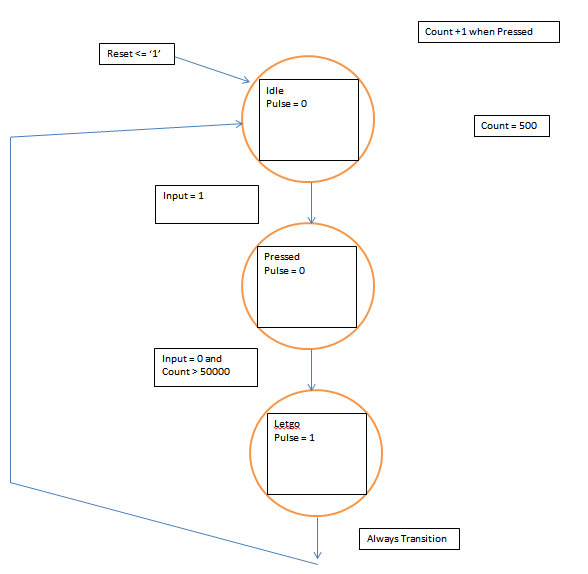
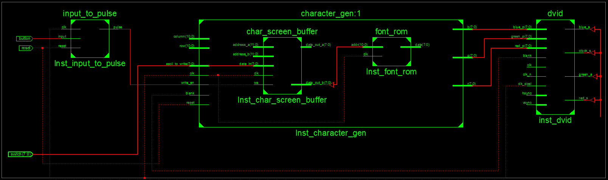

Lab3_Busho
==========

## Introduction
I created a font controller that allows a user to write a character to any location within a 30 by 80 
character grid on a VGA screen. The user was allowed to scroll through a list of characters using switches
and a button that used a Moore state machine to debounce to select which character they wanted. 


## Implementation
- I used A Moore state machine for my button presses. This made sure to debounce the buttons so the user
could select one character at a time. I used D Flip Flops for next state, current state, count, output buffers, and next output buffers for the input to pulse (button) module. 

  - This is an example of a D Flip Flop

``` VHDL
-- state register
	process(clk, reset)
	begin
		if (reset = '1') then
			state_reg <= idle;
		elsif (clk'event and clk = '1') then
			state_reg <= state_next;
		end if;
	end process;
```

  - This is an example of a mux

``` VHDL
count_next <= count_reg + 1 when ((button_next = pressed) and (input = '0')) else
						  to_unsigned(0,20);	
```

- I also created a testbench to test if the state machine worked. The testbench was too spread out to 
see all of it in one screen because a long delay was used to prevent debouncing. The following test was
performed.

``` VHDL
      wait for clk_period*10;

		reset <= '0';
		input <= '1';

		 wait for 100 ns;	

      wait for clk_period*10;

		input <= '0';
		wait for 600 us;
		input <= '1';
		wait for 1000 ns;
		input <= '0';	
```

- Input to pulse state diagram



- I used the character gen module essentially to hook up all of the components together. I instantiated
the character screen buffer and the font rom. This portion of the lab was learning how to hook up the 
various signals and understanding how someone else's components are supposed to work. We were given a 
font rom that contained the data on what pixels to color in for a given character. The screen buffer
was also given. This selected which character we were to color out of RAM when given a certain address
to find. 

- The character gen has inputs row and column to determine where on the screen a character is being
writeen. A counter was made to determine which character was altered based on the row and column. The
ASCII_to_write input was the address used to fetch a character from the screen buffer in RAM. The 
write_en was there to advance the counter and indirectly the character being written. 

- When all of the signals were hooked up with the screen buffer and font rom, the font rom outputted a
signal (7 downto 0). The signal was used to color the eight different columns that make up an individual
character. A mux was used that based on the last three bits in column would make the output color go high
if it was on the correct column that needed to be colored.

- Because the character gen was essentially hooking signals together, a block diagram of the character gen
and its top shell are included below.

- Block Diagram 



## Test/Debug

- Nothing would show up at first, need to check that device, configuration, and package are all properly
selected for the FPGA we are using. 
- The controller was unable to change the first character initially, this was fixed by changing my 
count_next variable to change to 0 on reset. Without this, it would start at 1 and then count would
go to 1 before I pressed the button. 
- The last column was not drawing properly. This is because I initially forgot the pipeline delays of
the VGA signals in the top shell. Once I added these with DFFs, the last column would draw. 
  
## Conclusion
In this lab, I learned how to read a graphical depiction of a module with its signals in order to 
figure out how the instantiated modules and internal signals are wired up to the inputs and outputs. I 
also learned pipeline delays may be necessary in order to sync up certain signals. This lab also helped 
me practice using other peoples' modules in addition to my own to create a controller.

- Documentation: C2C John Miller gave the idea to make a button state machine with the three states idle,
pressed, and released. He also told me 50000 clock cycles is a long enough delay. C2C Bentley explained
how a mux is needed to select one of the 8 bits from the font data in order to color the correct column.
He also showed me the math for calculating the address b signal for the screen buffer using column and row.
C2C Taorimina explained to me how the pipeline delays work via DFFs.
